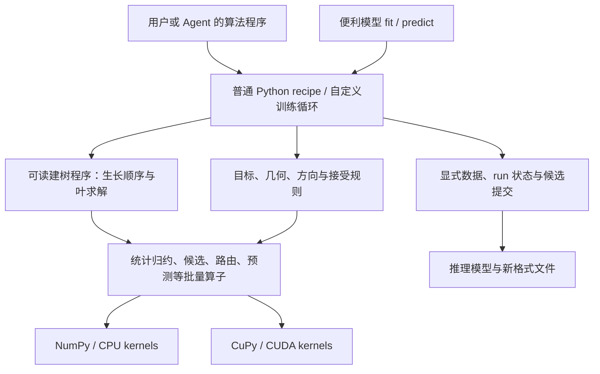

# OpenBoost v1：foundation 工程构建设计

日期：2026-09-05。设计基线：`be373e6`。**这是待实施设计，不是已有 API。**
执行更新：用户在 Sprint 002 要求删除旧生产实现；当前已退役，历史源码固定在
`50acfc6`。下面提到的旧模块是历史审阅对象；新 public 组件仍按本文构建。
本文件回答“foundation 具体怎么建”，与 [主计划](agent-boosting-foundation-plan.md)、
[任务卡](foundation-tasks.md)、[验收协议](openboost-v1-evaluation.md) 共同交付。
任务卡决定要表达哪些算法；本文决定公共组件、数据流、实现位置和逐步构建方法；
独立参考和 eval 判断实现是否正确、有用。三者缺一不能称为完整设计。

下面给出可直接开始实现的选择。名称与布局允许在 F1 的真实调用中调整，F2 正式
实验前才冻结接口；语义调整须更新本文、独立反例和受影响任务。所有 A1–A13 仍 required。

## 1. 产品中实际交付什么

交付三层代码：可直接调用的计算组件、用这些组件写成的普通 Python 算法、调用算法
的便利模型。Agent 既能使用现成 recipe，也能复制训练循环、改分裂规则、换叶求解器
或组合新几何；这些改动使用安装后公开模块，不要求继承一个统一 Booster。



类似 torch 的地方是：公共计算部件、显式状态、普通程序组合、可切换执行设备。
v1 的专门对象是 boosting 的统计、路由、弱学习器和迭代更新；不把通用 autograd、
自动编译任意 Python 或一个调度图编译器作为前置工程。

### 模块和依赖方向

下列路径均为计划新增/替换的 `src/openboost/` 公共模块；每个模块只在对应构建步骤
有实际调用方时创建，不先生成空框架。类型优先使用小 dataclass、数组和函数参数。

| 模块 | 放什么 | 依赖与修改入口 |
|---|---|---|
| `data/`、`targets/` | 特征 schema、fit/transform、prepared data；分类/区间/query/结构输入 | 只依赖基础数组与执行上下文；不 import recipe |
| `stats/` | 统计字段及权重语义，Newton / 方向回归适配 | 额外统计可由外部函数构造；不限制只有 G/H |
| `ops/` | 公共批量算子签名、CPU/CUDA 实现选择 | 不认识任务名或某个模型类；内部 kernel 可为私有实现 |
| `tree/` | 候选、评分/可行性、三种 grow、叶求解、拓扑和 payload | 调用 stats/ops；grow 的 Python 源码本身公开 |
| `objectives/` | loss、link、梯度、Fisher/GGN、方向函数 | 可读取整个 Problem；不要求逐行独立或每参数一棵树 |
| `runtime/` | device/stream/workspace、RNG、候选事务、run 集合 | 管资源和提交；不拥有唯一训练循环、不 import 具体 recipe |
| `artifacts/` | 推理模型、预测变换、版本化 reader/writer | 不依赖训练 objective/builder；声明额外推理依赖 |
| `recipes/` | R1–R9 的可运行普通函数和参考组合 | 使用以上公开入口；相同接口也供外部包使用 |
| `models/` | 可选 fit/predict 便利入口 | 委托 recipe 与推理模型；算法不复制进 facade |

独立数学代码在 `tests/v1/reference/`，不 import production；真实数据、baseline adapter、
runner 和 judge 在 `benchmarks/v1/`。防止测试只复述同一实现，也防止 benchmark 特例进入 core。

## 2. 先固定数据和状态，不继承旧容器限制

### 公共记录的最小内容

| 记录 | 必需内容 | 所有权与不变量 |
|---|---|---|
| `PreparedData` | row IDs、feature schema、binning state、codes/missing、data identity、device | 由 prepare/transform 建立并拥有存储；训练只读；验证集复用训练转换器 |
| `Problem` | prepared、typed target、train weight、offset、query/structure input、output schema | 各角色按 row ID 对齐；目标验证由 target 类型负责；辅助字段不自动成为特征 |
| `Geometry` | raw 快照版本、未加权导数、曲率种类/形状或求解函数、loss 信息 | 区分 exact Hessian、diagonal bound、Fisher、GGN；无需一律分配 N×K×K |
| `FitRequest` | split statistics、leaf statistics、leaf row context、learner output schema | split 与 leaf 可读取不同统计；不能只收一个含义不明的 grad/hess tuple |
| `TreeModel` | topology、分裂条件、scalar/vector payload、输出维数 | 可变节点数；提交后不可变；训练 scratch 不能改写历史树 |
| `AcceptedState` | train/validation raw `[N,K]`、base、learner terms、version、best/stop 状态 | 只由成功提交替换；offset 不重复累加；K 是一个 run 的参数轴 |
| `Proposal` | parent version、一个或多个 learner term、对应 raw delta、尝试系数 | 未提交不改变模型；联合多参数更新是同一事务 |
| `RunContext` | run ID、seed、round、device/stream、workspace、执行记录 | 显式传入；不读进程全局 backend；不同 run 不共享可变状态 |

这些记录是语义边界，不要求八层继承。`Geometry` 与 `FitRequest` 的适配是算法的
一部分，研究者可直接写普通函数。外部代码也可以跳过高层记录调用单个公开算子。

### 分箱和身份的首个实现

- 外部原始特征按 `[N,F]`；CPU 首版 codes 用 feature-major `[F,N]` 的 int32，
  missing 单独 bool mask，类别字典独立保存。常规 bin 编码从0开始，避免把255当公共
  语义。GPU 可在 F3 打包为 uint8/uint16，并保留显式 missing 信息和转换成本。
- `fit_binning` 首版在训练集上按数值列排序，使用明确的无权重分位点规则；默认
  最多254个常规 bin 是可调起点。重复 cut 合并、常数列单 bin；全缺失列不产生候选。
  对 B 个期望 bin，在有限训练值的经验分位点 j/B（j=1..B-1）作线性插值，
  保留满足 min<=cut<max 的唯一 cut；x<=cut 进入左区间，越界值进入两端 bin。
  cut 等于最小值仍可有效分裂，例如 `[0,0,0,1]`、B=2 的 cut=0，不能删掉它。
  非缺失的数值 inf 拒绝；F0.2 独立检验这些规则，F1 的实现使用相同语义。
  默认分箱不消费 sample weight；未来显式启用 weighted binning 时，权重进入 identity。
- 类别训练字典有稳定顺序；CPU 初版 one-category-vs-rest 枚举；unknown 按任务卡
  的 missing route。字典不受 validation/test 标签影响；不能把类别值当连续阈值。
- identity 包括训练内容/行顺序、schema、转换器版本/参数、cuts、字典和有关元数据，
  不能只用 Python object ID 或 shape。首次建立 hash，持有期间禁止原地改输入；
  不每轮重新 hash 全数据。不同 device 视图共享语义 identity，各自记录布局。
- `bind` 单独检查 target、offset、query 和结构输入的身份。prepared 可共享不代表
  raw、target 或权重相同；叶 row view 必须保持全局 row ID，不能错用局部排序位置。

## 3. 统计、方向和叶求解的连接方式

### 权重只作用一次的明确路径

标准二阶 recipe：objective 产生未加权 g/h，`stats.newton(g, h, train_weight)`
产生逐行 `wg/wh` 字段；聚合只做加法，叶求解器不再乘权重。收益和叶值沿任务卡
的半平方/二阶约定，不继承旧实验 builder 的两倍 gain 定义。

Normal/Formula：先用未加权几何求方向 `z=-solve(metric,g)`；
`stats.least_squares(z, fit_weight=train_weight)` 构造方向回归的 `g=-w*z, h=w`。
这里的 h 是回归曲率，不是原始概率模型的 Hessian。接受规则用原始 loss 评价更新候选。
多分类采用声明的对角上界；ranking 先在 query 内生成 pair，再把贡献归约到行，
query/pair weight 的施加在该适配中完成，不能再当普通 row weight 乘一次。

分位数：split 可消费 pseudo statistics；叶取得当前 residual 和原始 weight，直接
解 weighted quantile 或 D3 的带惩罚问题，不读已经加权的 residual 后再重复加权。

每个统计字段声明 `name / width / dtype / reduction=sum / weight_role`，结果携带
已应用权重的来源；重复使用加权适配器应报错。D2 的每 cohort information mass
是额外独立字段，不能自动乘 train weight。元数据便于检查误用，不能证明任意插件数学正确。

### 统计的物理存储

逐行字段可为数组 views 或按块生成，避免强制复制整个 `[N,S]`；S 是总浮点统计宽度。
CPU correctness 路径用 float64，count 单独 int64。Histogram 的逻辑维度为
`[active_nodes, feature_bins, S]`，各 feature 的 bins 由 offsets 表示，missing 独立累加。
另外保存节点总统计、物理 count 和正训练权重行数，不能把 count 当 H 或有效质量。

工作区按节点/特征分块；预估 `active_nodes * sum(bins_per_feature) * S * itemsize`
和 count/missing/候选/scratch 的峰值。预算不够先缩 block，最小 block 仍放不下则
明确报资源错误。禁止默认分配 `all_nodes * F * bins * K*K`。
父减子只可用于同一行集合分割的可加字段，右子来自真实路由的补集；不是比例缩放。

## 4. 把建树真正拆开，并公开每个决策

首版签名以下表为准，省略类型注释。`ctx` 含 device/stream/workspace；所有数组结果
留在所选设备。`rows` 是路由关系/分段索引，`active` 是实际节点 ID 列表。

| 函数 | 输入 → 输出 | 可改的算法决策 |
|---|---|---|
| `ops.histogram(data, rows, active, fields, *, ctx)` | codes、路由、可加字段 → 节点直方图与总量 | 新增统计字段；CPU 初版逐样本归约，CUDA 按 block 聚合 |
| `tree.candidate_stats(hist, schema, *, ctx)` | bins + missing/category 元数据 → candidate ID、左右统计、valid mask | 数值前缀和、类别集合；调用者可产生自己的候选 |
| `score(candidates, parent_stats, config)` | 候选统计 → gain 数组 | 默认 Newton gain；可替换向量评分或别的标量准则 |
| `feasible(candidates, constraints)` | 候选统计 → bool mask | 子节点有效质量、D2 每 cohort 信息量；不靠 NaN 表示非法 |
| `tree.choose(candidates, gains, valid, tie_policy)` | 评分、可行性 → 紧凑 SplitBatch | 字典序 tie；无候选显式 valid=False |
| `ops.partition(data, rows, splits, *, ctx)` | 旧路由、显式 child IDs → 新路由及 leaf row view | missing/category routing；行守恒，无交叉重复 |
| `ops.reduce_rows(rows, leaf_fields, *, ctx)` | 最终路由、独立叶字段 → 叶统计 | split sketch 不丢掉完整叶目标 |
| `leaf_solver(row_view, leaf_stats, leaf_context, config)` | residual/weight 或统计 → LeafPayload | Newton、quantile、带惩罚解、vector leaf |
| `ops.predict(tree, data, *, ctx)` | 拓扑和 payload → `[N,L]` | L 是学习器输出宽度；可与参数数 K 不同 |

`grow` 接收这些函数和 `FitRequest`；以下为 depthwise 的主要调用链，可复制改写：

```python
# Depthwise 设计伪代码：公共函数逐项实现后组成可运行示例。
while frontier:
    hist = ops.histogram(data, rows, frontier, fit.split_fields, ctx=ctx)
    candidates = candidate_stats(hist, data.schema, ctx=ctx)
    gains = score(candidates, hist.node_totals, split_config)
    valid = candidates.valid & feasible(candidates, constraints)
    splits = choose(candidates, gains, valid, tie_policy)
    selected = growth.select(splits, remaining_budget)
    selected = topology.append(selected)  # 返回含显式 child IDs 的分裂
    rows = ops.partition(data, rows, selected, ctx=ctx)
    frontier = growth.next_frontier(topology, selected)
leaf_stats = ops.reduce_rows(rows, fit.leaf_fields, ctx=ctx)
payload = leaf_solver(rows.leaf_view(), leaf_stats, fit.leaf_context, leaf_config)
return TreeModel(topology.freeze(), payload)
```

三个 grow 复用这些计算操作，各自写选择与循环；不强迫所有策略经过同一个有隐藏
状态的 `growth` 类。具体交付三个普通 Python 函数：

- **Depthwise：** 每层批量评价活动节点，接受各自合法且净 gain>0 的 split，达到
  depth/leaf/resource 预算即停；未分裂节点成为叶。层内预算冲突按固定 gain/ID 排序。
- **Best-first：** 堆保存每个可分叶的最佳候选，优先最大净 gain；相同 gain 按节点
  ID 和候选 ID。分裂后只计算新孩子，未受影响叶保留候选；所有引用有路由版本。
- **Symmetric：** 同层共用 feature/condition/missing direction；首版要求该候选在
  层内每个叶都合法，先按公共 candidate ID 对齐所有节点候选、对 valid 做 AND，
  对 gain 求和后才 choose；不能先选每个节点的最优项再拼起来。不存在则停止整层。
  预算必须容纳完整下一层。
  这是一条明确实现语义，不承诺与 CatBoost 每个训练细节相同。

从 numeric、标量叶开始，但额外信息量、missing、类别和 vector leaf 都通过以上入口
补齐。若实现要新增 `if task == ...` 或绕过显式传入的函数，当前构建步骤不能验收。

## 5. 树表示、参数映射和候选事务

树采用紧凑的数组集合：`left/right`、`feature`、`split_kind`、numeric cut 或类别集合
引用、`missing_left`、`leaf_index`。节点连续分配、孩子显式索引；首版 index=int32，
容量溢出在分配前拒绝，不要求 `2*i+1`，没有固定511节点/深度8的格式限制。
叶值独立为 `[n_leaves,L]`；对称树可用压缩内存布局，导出保持同一预测语义。
训练阶段按容量块增长、定稿裁剪；CUDA buffer 留在设备，checkpoint/export 时再搬运。
分裂的 cut/category ID 绑定保存的转换器版本；推理传入 prepared 时校验 schema/cuts
身份，原始 X 则先用模型转换器变换，不能拿另一套 bins 按相同整数解释。

模型 term 为 `learner + coefficient + output_mapping`。首版 mapping 支持列选择和
显式线性矩阵 `[L,K]`，一般方向用未收缩叶值，学习率只放 coefficient 一次。
scalar 树可更新一个参数，vector 树可联合更新 K 个参数。Formula 的 link/formula
属于 raw 之上的推理变换，不混进通用 tree prediction。

状态流程：`accepted(v) → proposal(parent=v) → evaluate → accept/reject`。

1. 根据 accepted raw 计算几何，拟合学习器；预测得到 base delta。回溯只改变 alpha，
   复用树与 delta，不为每个步长重新训练。train/validation 各有独立 cache。
2. candidate raw 在 scratch 中产生；默认保存的 raw 含 base 与学习器累积值，
   offset 由 objective/output transform 临时加入，绝不在每轮再次积累进 raw。
3. 接受时先完成候选预测、有限性/shape 和该算法要求的 loss 判定，再切换 raw buffer
   引用并追加 terms、系数和版本。stale parent version 不允许提交。
4. 拒绝时释放 scratch，不追加树/系数、不改 best 或 accepted raw。固定步长接受
   也通过同一提交流程；固定步长并不要求训练 loss 每次下降。
5. 联合更新的所有参数一起成功或拒绝；有序更新逐参数形成新版本，下一个读取最新
   accepted。outer round 的计数与参数子步骤分别记录；D4 最多6次回溯沿任务卡。
6. early stop 的 best snapshot 保存 term 截止位置、系数/映射及必要状态；恢复时
   raw cache 可重算，不能只裁剪树却保留未来系数或旧 cache。

输入只读、scratch 独占、已提交树持有稳定存储。CPU 用所有权/只读 view，CUDA
用清楚的生命周期和单一写入者；开发 conformance 通过校验和/注入复用查非法修改，
生产边界保留 shape/device/索引/数值状态检查，不默认每轮复制全部输入防插件改写。
异步 CUDA 错误必须在可观察的事务完成边界检查后才公开成功；同步成本计入 E4。

## 6. 同一 foundation 如何构成全部用例

| 用例 / Recipe | 算法程序中改变的部分 | 复用的基础部件 |
|---|---|---|
| A1 / R1 regression | 平方 loss → Newton FitRequest → grow → 固定步长 | stats、三种 grow、标量 payload、事务/推理 |
| A2 / R1 binary | logistic、class mapping、probability transform | 同一 grow/事务；CPU 类别与 missing 路径 |
| A3 / R1 multiclass | softmax/对角上界；同一快照产生 K 树并联合提交 | 参数轴、独立 scalar learner terms、向量 raw |
| A4 / R3 ranking | query 内 pair/lambda → 行贡献；每轮重新计算排序 | 行统计、相同 grow、seed 与 score 输出 |
| A5 / R2 quantile | pseudo split fields；叶读取 residual/weight | routed row view、可替换 leaf solver、同一预测路径 |
| A6 / R8 multi-output | 独立树或共享候选评分；完整 K 维叶统计 | 分裂/叶字段分离、vector payload、输出映射 |
| A7 / R4 Poisson | offset-aware loss/link 与 rate/count 输出 | Newton stats、grow、目标与 offset 的明确绑定 |
| A8 / R4 Gamma | 正目标 loss/导数与 log-mean link | 同一 scalar stats/grow/事务 |
| A9 / R4 aggregate | Tweedie 或两个 recipe 的 paid-frequency × severity | 显式权重/单位、模型组合 artifact，不另写 trainer |
| A10 / R5 AFT | interval target、事件/右删失 likelihood、时间输出 | 同一 Newton 请求/grow；typed target 的合法 inf |
| A11 / R6 Normal | 普通/Fisher方向 → 回归弱学习器；joint/ordered + 回溯 | 方向适配、scalar/vector terms、候选事务 |
| A12 / R7 Formula | 结构输入、Jacobian/GGN方向、参数 link、formula 输出 | 与 Normal 相同的方向拟合/接受部件，显式推理依赖 |
| A13 / R9 train-many | recipe/run 列表、逐 run 停止、兼容组调度 | 只读 prepared、独立 RunContext/AcceptedState、同一算子 |

这种复用必须由调用路径和测试证明，不能只看模块名字相同。例如 A5 更换叶求解后，
第二轮 residual 与保存后的预测必须反映新叶；A12 换 full/diagonal 方向无需改 grow；
D2 从外部提供额外字段和 feasible 函数即可执行，不为该任务新增 core 分支。

## 7. CPU、CUDA 与 train-many 的构建方式

### 执行实现和设备边界

CPU production 先用 NumPy 向量操作，热点逐行归约/路由可用仓库已用的 Numba CPU
kernel；独立 oracle 保持朴素 NumPy/循环，不能导入这些 kernel。先通过 float64 E1，
再声明低精度变体；不以速度为由放宽原 correctness 路径。

CUDA 首版选择 CuPy 作为数组/stream 所有者，优先复用经新契约验证的 CUDA kernel，
新增热点先用 numba-cuda；是否换 DSL 由 F3 profile 决定。具体依赖/driver 在 F0.3
冻结，本设计不假装这些新路径已运行。GPU 统计精度与 tie band 依 E1 预先登记。

- `ExecutionContext(device, stream, workspace, limits)` 显式选择执行。元数据在 host，
  codes/target/raw/统计/route/叶值在 device；循环只读取必需的紧凑决策/metric。
- prepare 的 fit/transform 首版可在 CPU 后一次上传，完整成本单列；这不是梯度或
  建树中途 fallback。驻留阶段不允许每棵树下载大数组再由 CPU 遍历更新 raw。
- 扩展的 score/feasible 可直接对 NumPy/CuPy 候选数组运算；不承诺逐候选 Python
  callback 自动变成 CUDA。只有 CPU 实现的组件在严格 CUDA 请求中预检拒绝。
- 能力检查针对实际传入组件、dtype、layout、target/payload 和更新规则；不能只凭
  recipe 类名认为可用。设备错误传播，不自动重跑 CPU 后报告 CUDA 成功。
- 首个优化粒度是每层多个节点、每批候选、每组学习器；先减少全量复制、临时分配和
  Python 往返，再考虑融合。优化组合必须记录所采用组件及语义版本，遇到替换组件
  则走支持该组件的公开组合路径或明确拒绝，不能绕过自定义逻辑。
- 每次基准记录 transfer bytes、同步、JIT 冷/暖策略、workspace 峰值和完整 fit/predict。
  正确性/quality/cost 都按已有 E1/E3/E4，单个 histogram 快不算基座交付。

### 多 run 从正确顺序执行开始

先交付 `run_many(specs, prepared, execution="sequential")`：每个 spec 调普通 recipe，
拥有独立 raw、terms、budget、best/stop 和错误。训练结束返回全量 run IDs 的记录；
预期故障注入在验证其被正确记录时通过，真实 required 任务失败仍使对应 gate 失败。

随机选择用 `(seed, run_id, round, component, purpose)` 稳定派生 key；首版以明确的
UTF-8 编码/hash 到 NumPy Generator 种子，F0.2 固定派生 fixture。CPU/CUDA parity
采样可共享 CPU 生成的索引并显式上传计成本，不依赖两个 RNG 后端碰巧给相同序列。
拒绝候选不消费以后步骤的 key；相同逻辑步骤的重试用相同 key，attempt ID 只记日志。

随后按 prepared identity、device、dtype、kernel/统计布局和当前阶段组成兼容组；
K 不同可分组，M 不等于 K。scheduler 只批量执行 recipe 明确暴露的共同阶段，
不负责自动分析任意 Python 程序。用 per-run offsets/active masks 管变长节点，停止
或失败的 run 退出后仍保存记录；共享 workspace 按生命周期复用，不共享 raw。
F3 顺序复用、批量执行分别与同 run ID 的独立结果对照，再验 M=1/8/32 的完整成本。

## 8. 推理格式与作者工作流

首版新格式选 JSON manifest + 不含 object 数组的 NPZ 数值块；reader 使用
`allow_pickle=False`。manifest 声明格式版本、feature/cut/category schema、base、
learner topology/payload/coefficients/mapping、output schema 和依赖。检查 shape、
索引范围、树无环、dtype、有限值及所需字段；损坏或旧格式明确失败。

基础 reader 支持标准 raw 树推理及内置 link/output transforms，模型不保存训练
objective、callback 或任意闭包。自定义 formula/payload 的推理代码由扩展包显式提供
codec/transform，并由调用方安装/指定；缺依赖明确失败、不自动下载或执行未知闭包。
CPU 进程能读 CUDA 导出的标准模型，无需 CUDA/训练插件；GPU 推理是另一个声明的
执行能力。A9 的组合模型保存两个子模型及组合语义，A7 保存所需 exposure 的契约。
checkpoint 若支持恢复训练，还需单独保存 run/算法配置/随机状态，不能把 inference
artifact 冒称任意算法都可 resume。首版以可复现推理和内存中的 best 恢复为 required。

每个公开组件随实现交付：输入输出示例、数学/权重约定、shape/dtype/device、所有权、
失败信息、最小独立 fixture 和至少一个实际调用方。错误包含 run/round/component、
字段和期望/实际 schema。recipe 是阅读入口；作者不必先读 runtime 或 kernel 才能改 loss。
安装→跑 baseline→改一处→比较两轮 trace→保存/新进程预测，是每个 A 的工作流验收。

## 9. 具体怎么开工：按可验收的小提交构建

本表细化既有 F 阶段，不新增一轮抽象路线图。F0.2 可以分数学小提交；其 reference
是正确性准备，**foundation 的实际产品实现从 F1 开始**。B 编号仅用于本文的构建切片。

| 切片 / 阶段 | 实际创建或替换 | 最小验收与独立失败样例 |
|---|---|---|
| B01 / F0.2 | scalar/tree 独立枚举，再依任务卡补几何、typed data、事务/run 参考 | 手算不一致应失败；零权重、tie、拒绝更新、第二轮梯度、全部 A 的独立公式 |
| B02 / F0.3 | manifest/adapter/runner/judge、数据 hash、版本/预算/保留题 | 缺项/污染缓存/对照报错不判 pass；不提前宣布新基座收益 |
| B03 / F1.1 | data/targets 的最小 numeric Problem，RunContext、AcceptedState、最小 artifact | 两个 run 身份与只读输入；用人造常数树测 accept/reject、offset与保存，不依赖真实 grow |
| B04 / F1.2 | CPU stats、histogram、candidate/score/feasible/choose、partition、scalar leaf、depthwise | 固定 bins 的手算两层树；额外信息质量直接换 feasible；无旧 builder 包装 |
| B05 / F1.3 | 平方误差与 Normal 两个完整 Python recipe | 两轮中间量/输出/round trip；Normal fixed/backtracking 含全拒绝；首次看到完整 foundation 路径 |
| B06 / F1.4 | Formula 几何/结构输入、sequential run_many | A12 两轮；M=1/2/8、不同 K/stop/error；若需绕开状态则立即调整 B03 |
| B07 / F1.2、F1.5 | best-first/symmetric、numeric missing、CPU categorical、class schema | 三种独立 topology、missing 两方向、unseen mapping；复用 B04 算子 |
| B08 / F1.5–F1.6 | binary/multiclass、vector leaf 与输出 mapping | A2/A3/A6；联合 K 更新、分裂 sketch 与完整叶统计分开 |
| B09 / F1.5–F1.6 | ranking 的 pair/lambda；quantile 与带惩罚叶求解 | A4/A5、D3；路由后的 residual/weight、第二轮状态和 query 隔离 |
| B10 / F1.5–F1.6 | Poisson/Gamma/Tweedie、AFT 的各自 recipe 与变换 | A7/A8/A9/A10 逐项；offset/单位/合法 inf、组合模型 round trip |
| B11 / F1.6、F2 | 补齐 A1–A13 工作流，独立扩展包与作者实验 | E0 CPU/E1/E2 全覆盖；D1–D5/H1–H2 与 E5。发现性试用可在 B05 后开始 |
| B12 / F3.1–F3.2 | device ops + required CUDA recipes、非默认组件、多参数更新 | R1/R4/R5/R6/R8 declared 子集的两轮/质量/持久化 parity；可见同步，无被绕过组件 |
| B13 / F3.3 | 兼容组 scheduler、批量 histogram/route/predict、可验证的融合 | 同 run ID 的 M=1/8/32 独立结果；E4 时间/显存/失败记录 |
| B14 / F4–F5 | 全部 A 真实任务 artifacts、clean wheel/docs、删除无调用方旧路径 | E3/E6；独立作者与重复使用按 E7 另验，不以内部成功冒充 adoption |

B07–B10 内按各自 recipe 再拆提交，不能一个大提交埋掉失败。B11 的正式作者实验等
所需组件完成；数据/基线准备从 B02 开始，真实评测在各 recipe 稳定后可穿插执行。
不是等 B14 才首次接触真实数据。实现顺序按依赖，全用例完成义务不变。

### 旧代码的使用方式与设计停止条件

- 现有 `_core/_primitives.py`、`_core/_growth.py` 已有组件/多种生长的尝试；保留可
  验证计算和失败样例。新公开层不能仅包装旧全局 backend、固定 G/H/节点布局和 trainer。
- 现有 `experimental` 的插件优先级、scratch 脱离、prediction cache 一致性和 rollback
  测试保留为语义来源。新权重/gain 约定不同，重建手算期望，不能复制旧数值充当真值。
- 用户已要求提前清空旧生产层，F1 直接建立新公共入口，不做兼容 shim、双写或两套
  trainer。历史基线用固定 revision/wheel，而非依赖当前旧 import。
- 如果 B05/B06 不能复用同一统计/路由/状态部件，先修该边界；如果 B09 叶求解仍只能
  接 G/H，先修 row view；如果 GPU 必须每轮拉回全量 raw，先修驻留/所有权再谈 fusion。
- 本设计现在可指导实现；独立参考、CPU/CUDA 代码、作者收益与全部实际质量尚未验证。
  完成本文不会把任何 F1 或 E-gate 勾为通过，也不改变既有门槛。
