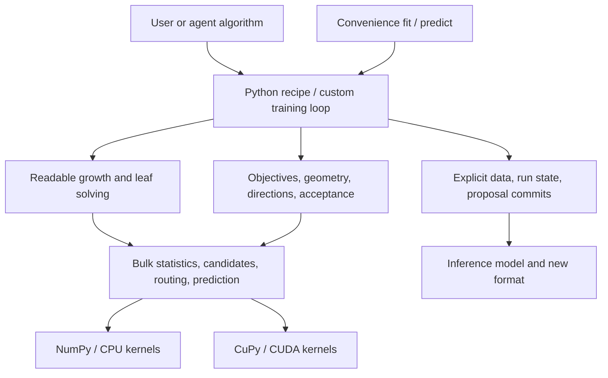

# OpenBoost v1: Foundation engineering construction design

Date: 2026-09-05. Design baseline: be373e6. **Planned implementation, not an existing API.**
Execution update: the user requested old production deletion in Sprint 002; it is retired and
preserved at `50acfc6`. Old modules below refer to historical review targets; new public components
follow this design. Together with the [main plan](agent-boosting-foundation-plan.md),
[tasks](foundation-tasks.md) and [evaluation](openboost-v1-evaluation.md), this answers how to build
the foundation. Tasks define algorithms; this file defines components, dataflow, locations and build
steps; oracles/evaluation judge correctness/value. All three are required for a complete design.

Choices below can be implemented directly. Names/layout may change through F1 usage; freeze interfaces
before formal F2. Semantic changes update this design, oracles and affected tasks. All A1–A13 remain required.

## 1. What the product delivers

Three layers: directly callable computation, ordinary Python algorithms composed from it, and
convenience models invoking algorithms. Agents can run recipes, copy loops, change split rules,
replace leaves or compose geometries through installed public modules, without one universal Booster base class.



The torch analogy is public computation, explicit state, ordinary composition and device choice.
v1 specializes in boosting statistics, routing, weak learners and iterative updates; general autograd,
arbitrary-Python compilation and scheduling-graph compilers are not prerequisites.

### Modules and dependency direction

Planned public modules under src/openboost, created only when a build step has a real consumer,
not as empty scaffolding. Prefer small dataclasses, arrays and function arguments.

| Module | Contents | Dependencies/change surface |
|---|---|---|
| data/, targets/ | Feature schema, fit/transform, prepared data; classification/interval/query/structure | Basic arrays/execution context only, not recipes |
| stats/ | Fields, weight semantics, Newton/direction-regression adapters | External functions can add statistics; beyond G/H |
| ops/ | Public bulk signatures and CPU/CUDA dispatch | No task names/model classes; private kernels allowed |
| tree/ | Candidates, score/feasibility, three growth policies, leaves, topology/payload | Uses stats/ops; grow Python is public |
| objectives/ | Loss, links, gradients, Fisher/GGN, directions | Can read whole Problem; not necessarily row-independent or per-parameter trees |
| runtime/ | Device/stream/workspace, RNG, transactions, run collections | Resources/commits, not one loop or recipe imports |
| artifacts/ | Inference models, output transforms, versioned readers/writers | Independent of training objectives/builders; declared inference dependencies |
| recipes/ | Runnable R1–R9 ordinary functions/reference compositions | Uses the same public interfaces as external packages |
| models/ | Optional fit/predict convenience APIs | Delegates to recipes/inference; no copied algorithm logic |

Independent mathematics lives in tests/v1/reference with no production imports. Real data, adapters,
runner/judge live in benchmarks/v1. Avoid self-referential tests and benchmark-specific core branches.

## 2. Data and state without inherited container restrictions

### Minimum public records

| Record | Required contents | Ownership/invariants |
|---|---|---|
| PreparedData | Row IDs, feature schema, bin state, codes/missing, identity, device | prepare/transform owns storage; training read-only; validation reuses training transformer |
| Problem | Prepared data, typed target, weight, offset, query/structure, output schema | Roles aligned by row ID; target types validate support; auxiliary fields are not automatic features |
| Geometry | Raw snapshot version, unweighted derivatives, curvature kind/shape or solver, loss | Distinguish exact Hessian, diagonal bound, Fisher, GGN; no universal N×K×K allocation |
| FitRequest | Split fields, leaf fields, row context, learner output schema | Split/leaf may differ; not an ambiguous grad/hess tuple |
| TreeModel | Topology, conditions, scalar/vector payload, output width | Variable nodes; immutable after commit; scratch cannot overwrite history |
| AcceptedState | Train/validation raw[N, K], base, terms, version, best/stop | Replaced only by successful commit; offset not accumulated repeatedly; K is within-run parameter axis |
| Proposal | Parent version, one/more terms, raw delta, trial coefficient | No precommit mutation; joint parameter updates are one transaction |
| RunContext | Run ID, seed, round, device/stream, workspace, execution record | Explicit, no global backend, no shared mutable run state |

These are semantic boundaries, not eight inheritance layers. Geometry→FitRequest adaptation is
algorithm code authors can write as functions. External code may bypass high-level records to call an operation.

### Initial binning and identity

- External raw features are[N, F]. Initial CPU codes are feature-major[F, N]int32 with separate
  boolean missing mask/category dictionaries. Regular codes start0; 255 is not public semantics.
  F3 may pack uint8/uint16 with explicit missingness and conversion costs.
- fit_binning sorts finite training values and uses explicit unweighted quantiles; default at most254
  regular bins is configurable. Merge duplicate cuts; constant columns have one bin; all-missing
  columns have no candidates. For B bins, interpolate empirical quantiles j/B, j=1..B-1; retain unique
  min<=cut<max. x<=cut goes left; out-of-range values use end bins. Minimum-value cuts are valid:
  [0,0,0,1], B=2 gives cut0. Reject nonmissing infinity. F0.2 independently checks these rules;
  F1 uses the same semantics. Default binning ignores weights; future explicit weighted binning includes weights in identity.
- Stable category dictionaries, initial CPU one-category-versus-rest enumeration, unknown follows
  task-card missing route. Validation/test labels cannot affect dictionaries; categories are not numeric thresholds.
- Identity covers content/order, schema, transformer version/parameters, cuts, dictionaries/metadata,
  not object ID/shape. Hash initially and prohibit in-place input mutation while owned; do not rehash
  every round. Device views share semantic identity but record their own layouts.
- bind checks targets, offsets, queries and structure separately. Shared prepared data does not mean
  equal raw/targets/weights. Leaf views retain global row IDs, not accidental local sorted positions.

## 3. Connecting statistics, directions and leaf solving

### Exactly-once weights

Standard second-order objectives emit unweighted g/h. stats.newton(g, h, train_weight) creates wg/wh;
aggregation sums and leaves do not reweight. Use task-card half-square/second-order gains, not old doubled gains.

Normal/Formula solve unweighted z=-solve(metric, g), then stats.least_squares(z, fit_weight=train_weight)
creates g=-w*z, h=w. This h is regression curvature, not the original likelihood Hessian. Acceptance
uses original loss. Multiclass uses its named diagonal bound. Ranking generates query pairs then
reduces contributions to rows, applying query/pair weights there without applying row weights again.

Quantile splits may use pseudo-statistics; leaves read current residuals/original weights and solve
weighted quantiles or D3 penalties, not preweighted residuals weighted again.

Each field declares name/width/dtype/reduction=sum/weight_role and applied-weight provenance;
reapplying a weighted adapter fails. D2 cohort information is independent, not automatically multiplied
by training weight. Metadata detects misuse but cannot prove arbitrary plugin mathematics.

### Physical storage

Per-row fields may be views or block-generated rather than copied[N, S], where S is total floating
statistic width. CPU correctness uses float64 and separate int64 counts. Histograms logically use
[active_nodes, feature_bins, S], feature-bin offsets and separate missing accumulation. Retain node
statistics, physical counts and positive-training-weight row counts; count is not H or effective mass.

Block workspace by nodes/features. Estimate active_nodes*sum(bins_per_feature)*S*itemsize plus
count/missing/candidate/scratch peaks. Reduce blocks to fit; fail explicitly if the smallest cannot.
Never default-allocate all_nodes*F*bins*K*K. Parent-minus-child applies only to additive fields of
an actual partition, with right as routed complement, never proportional scaling.

## 4. Expose every tree-building decision

Initial signatures below omit annotations. ctx contains device/stream/workspace; array outputs
remain on device. rows describes routing/segmented indices; active contains actual node IDs.

| Function | Inputs→outputs | Editable decision |
|---|---|---|
| ops.histogram(data, rows, active, fields,*, ctx) | Codes/routing/additive fields→histograms/totals | Extra fields; CPU row reduction, CUDA block aggregation |
| tree.candidate_stats(hist, schema,*, ctx) | Bins/missing/categories→IDs, left/right stats, valid mask | Numeric prefixes/category sets; authors can supply candidates |
| score(candidates, parent_stats, config) | Candidate stats→gain array | Newton default, vector or other scalar criteria |
| feasible(candidates, constraints) | Candidate stats→bool mask | Child mass, D2 cohort information; invalid is not NaN |
| tree.choose(candidates, gains, valid, tie_policy) | Scores/validity→compact SplitBatch | Lexicographic ties; no candidate has valid=False |
| ops.partition(data, rows, splits,*, ctx) | Old routing/explicit child IDs→new routing/leaf views | Missing/category routing, conservation, no duplicates |
| ops.reduce_rows(rows, leaf_fields,*, ctx) | Final routing/independent leaf fields→leaf stats | Split sketches retain full leaf targets |
| leaf_solver(row_view, leaf_stats, leaf_context, config) | Residual/weights or stats→LeafPayload | Newton, quantile, penalized, vector |
| ops.predict(tree, data,*, ctx) | Topology/payload→[N, L] | Learner output L may differ from parameter K |

grow receives these functions and FitRequest. Readable/copyable depthwise pseudocode:

```python
# Becomes a runnable example as each public operation is implemented.
while frontier:
    hist = ops.histogram(data, rows, frontier, fit.split_fields, ctx=ctx)
    candidates = candidate_stats(hist, data.schema, ctx=ctx)
    gains = score(candidates, hist.node_totals, split_config)
    valid = candidates.valid & feasible(candidates, constraints)
    splits = choose(candidates, gains, valid, tie_policy)
    selected = growth.select(splits, remaining_budget)
    selected = topology.append(selected)  # returns explicit child IDs
    rows = ops.partition(data, rows, selected, ctx=ctx)
    frontier = growth.next_frontier(topology, selected)
leaf_stats = ops.reduce_rows(rows, fit.leaf_fields, ctx=ctx)
payload = leaf_solver(rows.leaf_view(), leaf_stats, fit.leaf_context, leaf_config)
return TreeModel(topology.freeze(), payload)
```

Three ordinary Python growth functions share computation but own their loops/selection; no mandatory
hidden-state growth class:

- **Depthwise:** batch active nodes per level, accept valid net gain>0 until depth/leaf/resource
  budgets. Unsplit nodes are leaves; within-level budget conflicts use fixed gain/ID order.
- **Best-first:** heap of best splittable-leaf candidates, maximum net gain first, ties by node/candidate
  ID. Recompute new children only; unaffected candidates remain with routing-version references.
- **Symmetric:** common feature/condition/missing direction per level. Initially require legality
  in every leaf. Align common candidate IDs, AND validity, sum gains, then choose; never combine node
  winners. Stop the whole level if none; budget must fit the entire next level. This explicit
  semantics does not promise every CatBoost training detail.

Start numeric/scalar, then complete extra information, missing, categories/vector leaves through the
same entries. Task-name branches or bypassed supplied functions prevent acceptance.

## 5. Trees, parameter mappings and proposal transactions

Compact arrays: left/right, feature, split_kind, numeric cut or category-set reference, missing_left,
leaf_index. Allocate continuous nodes with explicit children; initial int32 indices reject capacity
overflow before allocation. No2*i+1 requirement, fixed511 nodes or depth8 format limit. Separate
[n_leaves, L] payload. Symmetric trees may compress storage while preserving export semantics.
Grow capacity in blocks, trim on finalization. CUDA buffers remain device-side until checkpoint/export.
Conditions bind transformer versions; prepared inference verifies schema/cut identity, raw X uses
saved transforms. Equal integer bins from different transformers are not interchangeable.

Terms contain learner+coefficient+output_mapping. Initial mappings support column selection and
explicit[L, K]matrices. Usually leaves are unshrunk and learning rate appears once in coefficient.
Scalar trees can update one parameter, vectors jointly update K. Formula/link are transforms above
raw, not part of generic tree prediction.

State: accepted(v)→proposal(parent=v)→evaluate→accept/reject.

1. Compute geometry from accepted raw, fit learner, predict base delta. Backtracking changes alpha
   and reuses trees/deltas rather than retraining. Train/validation caches are separate.
2. Candidate raw lives in scratch. Stored raw contains base+learner sums; objective/output temporarily
   applies offset, never accumulates it each round.
3. Before acceptance, finish candidate prediction, finite/shape checks and algorithm-specific loss
   checks. Then switch raw buffers and append terms/coefficients/version. Reject stale parents.
4. Rejection frees scratch without appending trees/coefficients or changing best/accepted raw.
   Fixed steps use the same transaction, but need not decrease training loss every time.
5. Joint parameters accept/reject together. Ordered updates create versions per parameter, next
   reads latest accepted state. Track outer rounds/substeps separately; D4 has at most6 trials.
6. Best snapshots retain term cutoff, coefficients/mappings and required state. Restoration may
   recompute raw; never trim trees while leaving future coefficients/stale caches.

Inputs are read-only, scratch exclusive, committed trees stable. CPU ownership/read-only views and
CUDA explicit lifetimes/single writers enforce this. Development conformance uses checksums/injected
reuse to detect mutation; production boundaries check shape/device/indices/numerical state without
copying all inputs every round. Observe async CUDA errors at transaction completion before reporting
success; count synchronization in E4.

## 6. Composing every application

| Application/recipe | Changing algorithm code | Shared components |
|---|---|---|
| A1/R1 | Squared loss→Newton FitRequest→grow→fixed step | Stats, three growth policies, scalar payload, transactions/inference |
| A2/R1 | Logistic, class mapping, probability transform | Same grow/state, CPU categories/missing |
| A3/R1 | Softmax/diagonal bound, K trees from one snapshot, joint commit | Parameter axis, scalar terms, vector raw |
| A4/R3 | Query pairs/lambdas→rows, new ranking each round | Row stats, grow, seeds, score output |
| A5/R2 | Pseudo split fields, residual/weight leaves | Routed views, replaceable leaves, same prediction |
| A6/R8 | Independent trees/shared scoring, full K leaf fields | Separate split/leaf fields, vector payload, mapping |
| A7/R4 | Offset-aware objective/link, rate/count | Newton/grow, explicit target/offset binding |
| A8/R4 | Positive loss/derivatives, log-mean | Same scalar stats/grow/transaction |
| A9/R4 | Tweedie or paid-frequency×severity | Explicit weights/units, composed artifact, no extra trainer |
| A10/R5 | Intervals, event/right-censor likelihood, time output | Newton/grow, valid typed infinity |
| A11/R6 | Ordinary/Fisher→regression learners, joint/ordered/backtracking | Direction adapters, scalar/vector terms, transactions |
| A12/R7 | Structure, Jacobian/GGN, links/formula output | Same direction-fit/acceptance as Normal, declared inference dependencies |
| A13/R9 | Recipe/run lists, per-run stopping, compatible scheduling | Read-only prepared, independent contexts/state, same operations |

Prove reuse through calls/tests, not names. A5 leaf changes must affect second residuals and loaded
predictions. A12 full/diagonal directions need no grow edits. D2 supplies external fields/feasible
functions without a core branch.

## 7. CPU, CUDA and train-many construction

### Implementations/device boundaries

CPU production starts with NumPy vector operations; hot row reduction/routing may use existing
Numba CPU kernels. Oracles stay naive NumPy/loops without importing kernels. Pass float64 E1
before declaring lower precision; speed never relaxes the original correctness path.

Initial CUDA: CuPy owns arrays/streams, reuse kernels only after new-contract verification, new hot
kernels initially use numba-cuda. F3 profiling decides DSL changes. F0.3 pins dependencies/drivers;
this design does not claim execution. Preregister precision/tie bands under E1.

- Explicit ExecutionContext(device, stream, workspace, limits). Host metadata; device codes, targets,
  raw, stats, routing/leaves. Loops read only compact decisions/metrics when needed.
- Initial prepare may fit/transform on CPU then upload once with full costs recorded. This is not
  mid-objective/tree fallback. Resident fitting cannot download large arrays per tree for CPU raw updates.
- score/feasible can operate directly on NumPy/CuPy arrays; per-candidate Python callbacks are not
  automatically CUDA. Strict CUDA requests preflight-reject CPU-only components.
- Check actual components, dtype, layout, target/payload/update policies, not recipe class names.
  Propagate device errors; never rerun CPU and report CUDA success.
- First optimize multiple nodes/candidate batches/learner groups. Reduce copies, allocations and
  Python round trips before fusion. Optimized combinations record component/semantic versions;
  replacements use supported public composition or explicitly fail, never bypass customization.
- Record transfer bytes, sync, JIT cold/warm policy, workspace peak and full fit/predict. Apply E1/E3/E4;
  a fast histogram is not the foundation deliverable.

### Multiple runs begin with correct sequential execution

First implement run_many(specs, prepared, execution="sequential"): ordinary recipes with independent
raw, terms, budgets, best/stop/errors. Return records for all run IDs. Expected fault injection passes
when recorded correctly; actual required failures still fail the gate.

Derive stable keys(seed, run_id, round, component, purpose) via explicit UTF-8/hash to NumPy seeds,
with F0.2 fixed fixtures. CPU/CUDA parity may use CPU-generated indices with upload costs rather
than assuming matching RNG implementations. Rejection does not consume future keys; same-step retry
uses the same key; attempt ID is logging only.

Then group prepared identity, device, dtype, kernel/statistic layout/current stage. Different K may
group separately; M is not K. Scheduler batches explicitly exposed common stages, not arbitrary-Python
analysis. Use per-run offsets/active masks for variable nodes; stopped/failed runs retain records.
Reuse workspace by lifetime, not raw state. F3 compares sequential reuse and batching against
independent same-ID results before measuring M=1/8/32 full costs.

## 8. Inference format and author workflow

Initial format: JSON manifest plus non-object NPZ arrays; reader uses allow_pickle=False. Declare
version, feature/cut/category schema, base, topology/payload/coefficients/mappings, output schema/dependencies.
Check shapes, index ranges, acyclic trees, dtypes, finite values/required fields. Corrupt/old formats fail.

Core reader supports standard raw trees/built-in output transforms, not saved training objectives,
callbacks or closures. Extensions explicitly provide custom formula/payload codecs/transforms;
callers install/select them. Missing dependencies fail, without automatic downloads/unknown closure
execution. CPU reads standard CUDA exports without CUDA/training plugins; GPU inference is separately
declared. A9 saves both submodels/composition; A7 saves exposure requirements. Resumable checkpoints
also need run/algorithm config/random state; inference artifacts do not imply arbitrary resume.
Reproducible inference and in-memory best restoration are initially required.

Each component ships input/output examples, math/weight conventions, shape/dtype/device, ownership,
errors, minimal independent fixtures and a real consumer. Errors identify run/round/component, field,
expected/actual schema. Recipes are the reading entry; changing loss should not require runtime/kernel
study. Every application's workflow checks install→baseline→one change→two-round comparison→save/new-process predict.

## 9. Build in independently acceptable commits

This refines existing F phases, not another abstract roadmap. F0.2 can split by mathematics;
**actual foundation product implementation begins in F1**. B numbers identify construction slices only.

| Slice/phase | Create/replace | Minimum acceptance/counterexample |
|---|---|---|
| B01/F0.2 | Scalar/tree enumeration, then geometry, typed data, transactions/runs | Hand mismatch fails; zero weights, ties, rejection, round2 gradients, all application formulas |
| B02/F0.3 | Manifest/adapters/runner/judge, data hashes, versions/budgets/held-outs | Missing/polluted/failed controls cannot pass; no premature benefits |
| B03/F1.1 | Numeric Problem, RunContext, AcceptedState, minimal artifact | Two IDs/read-only inputs; synthetic constant trees check accept/reject, offset/save without grow |
| B04/F1.2 | CPU stats/histogram/candidates/score/feasible/choose/partition/scalar leaves/depthwise | Hand two-level fixed-bin tree; replace feasibility for information mass; no old builder wrapper |
| B05/F1.3 | Complete squared/Normal Python recipes | Two rounds/intermediates/output/roundtrip; fixed/backtracking/full rejection; first complete foundation path |
| B06/F1.4 | Formula geometry/structure, sequential run_many | A12 two rounds; M=1/2/8, different K/stop/error; fix B03 if state bypass required |
| B07/F1.2, F1.5 | Best-first/symmetric, missing, CPU categories, class schema | Three independent topologies, both missing routes, unseen mapping; reuse B04 ops |
| B08/F1.5–F1.6 | Binary/multiclass, vector leaves, mappings | A2/A3/A6, joint K, separate sketch/full leaves |
| B09/F1.5–F1.6 | Ranking pairs/lambdas, quantile/penalized leaves | A4/A5/D3, routed residual/weight, round2/query isolation |
| B10/F1.5–F1.6 | Poisson/Gamma/Tweedie/AFT recipes/transforms | Individual A7–A10, offset/units/valid infinity, composed roundtrip |
| B11/F1.6, F2 | Complete A1–A13 workflows, external extensions, author experiments | CPU E0/E1/E2, D1–D5/H1–H2/E5; exploratory trials can start after B05 |
| B12/F3.1–F3.2 | Device ops/required recipes, nondefaults, multiparameter updates | R1/R4/R5/R6/R8 two-round/quality/persistence parity, visible sync, no bypass |
| B13/F3.3 | Compatible scheduler, batched histogram/route/predict, verified fusion | Same-ID M=1/8/32 independent results; E4 time/memory/failures |
| B14/F4–F5 | All real application artifacts, clean wheel/docs, unused-path removal | E3/E6; independent repeat use E7, not internal adoption |

Split B07–B10 by recipe; large commits cannot hide failures. Formal B11 waits for required components.
Data/baselines start B02, real evaluation follows stable recipes, not first contact with data at B14.
Dependencies determine order, not whether every case must finish.

### Old-code use and design stop conditions

- Historical _core/_primitives.py and _core/_growth.py attempted components/multiple policies.
  Preserve verified computation/counterexamples; public layers cannot merely wrap global backend, fixed G/H/layout/trainers.
- Experimental plugin precedence, scratch detachment, prediction-cache consistency and rollback
  tests inform semantics. Recompute hand values for new weight/gain conventions, not copied old truth.
- User requested early production reset. F1 builds public entries without shims, dual writes or
  two trainers. Historical baselines use fixed revisions/wheels, not current imports.
- If B05/B06 cannot share statistics/routing/state, fix that boundary. If B09 leaves only receive
  G/H, fix row views. If GPU pulls full raw every round, fix residency/ownership before fusion.
- This design guides implementation; references, CPU/CUDA code, author benefits and all real quality
  still require verification at this design baseline. The document itself passes no F1/E-gate and changes no thresholds.
